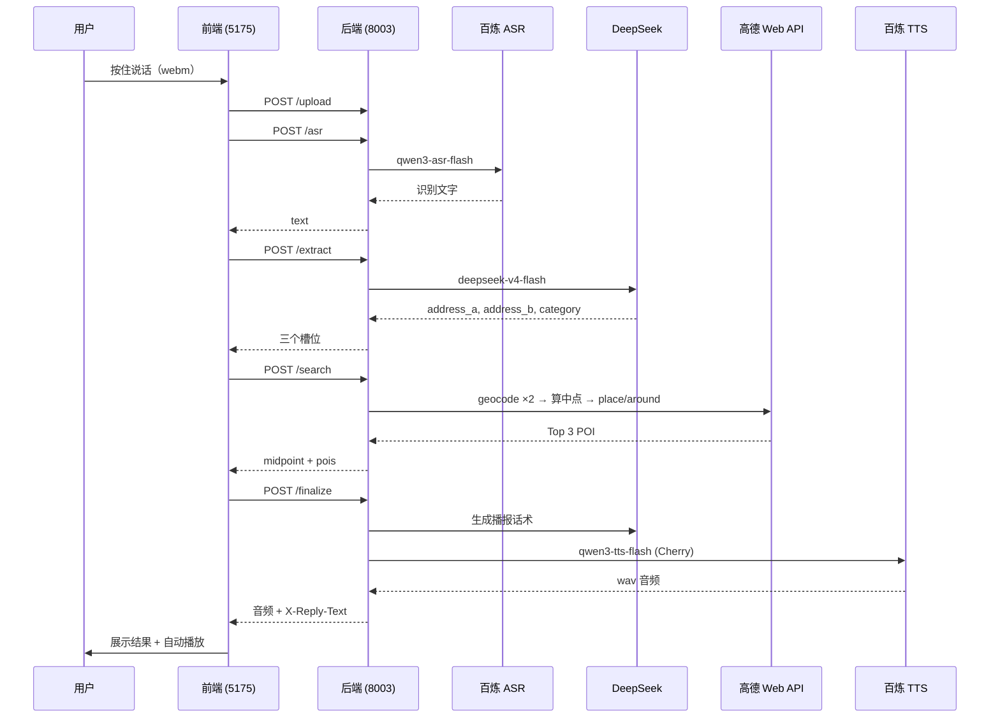

# 语音约碰面

**语音约碰面地点助手**：对着网页说一句话，系统自动识别你的位置、朋友的位置和碰面意图，在两人中间搜真实地点，并用语音播报推荐结果。

示例：「我在杭州东站，朋友在蒋村地铁站，在哪碰面合适？」→ 识别文字 → 提取两个地址 → 地图算中点 → 推荐附近 Top 3 地点 → 自动语音播报。

---

## 链路示意图



---

## 技术栈

| 层级 | 技术 |
|------|------|
| **前端** | React 19、Vite 6、Axios、MediaRecorder API |
| **后端** | Python 3、FastAPI、Uvicorn、httpx、aiofiles、python-dotenv |
| **外部服务** | 阿里百炼 ASR（`qwen3-asr-flash`）、百炼 TTS（`qwen3-tts-flash`）、DeepSeek（`deepseek-v4-flash`）、高德 Web 服务 API（地理编码 + 周边搜索） |

---

## 本地运行

### 1. 克隆与环境变量

```bash
git clone git@github.com:jacksonjk002-source/Audio_helper.git
cd Audio_helper
cp backend/.env.example backend/.env
```

编辑 `backend/.env`，填入各 API Key（见下方变量说明）。

### 2. 后端（端口 8003）

**macOS / Linux**

```bash
cd backend
python3 -m venv .venv
source .venv/bin/activate
pip install -r requirements.txt
uvicorn main:app --reload --port 8003
```

**Windows（PowerShell）**

```powershell
cd backend
python -m venv .venv
.\.venv\Scripts\Activate.ps1
pip install -r requirements.txt
uvicorn main:app --reload --port 8003
```

验证：浏览器打开 http://127.0.0.1:8003/health ，应返回 `{"status":"ok"}`。

### 3. 前端（端口 5175）

另开一个终端：

```bash
cd frontend
npm install
npm run dev
```

浏览器打开 http://localhost:5175 ，允许麦克风权限后按住说话即可体验。

---

## 环境变量（`backend/.env`）

> 仅在后端读取，**不要**提交真实 Key 到 Git。复制 `backend/.env.example` 为 `backend/.env` 后填写。

```env
BAILIAN_API_KEY=sk-xxxxxxxx
AMAP_API_KEY=xxxxxxxxxxxxxxxx
DEEPSEEK_API_KEY=sk-xxxxxxxx
DEEPSEEK_BASE_URL=https://api.deepseek.com
BACKEND_PORT=8003
FRONTEND_ORIGIN=http://localhost:5175
```

| 变量 | 用途 |
|------|------|
| `BAILIAN_API_KEY` | 百炼 ASR + TTS |
| `AMAP_API_KEY` | 高德 Web 服务（地理编码、周边 POI） |
| `DEEPSEEK_API_KEY` | 信息提取 + 播报话术生成 |
| `DEEPSEEK_BASE_URL` | DeepSeek API 根地址（可选，默认如上） |
| `BACKEND_PORT` | 后端端口（文档用，启动时以 uvicorn 参数为准） |
| `FRONTEND_ORIGIN` | 前端地址（文档用，CORS 已在代码中配置 5175） |

---

## API 一览

| 方法 | 路径 | 说明 |
|------|------|------|
| GET | `/health` | 健康检查 |
| POST | `/upload` | 上传录音文件 |
| POST | `/asr` | 语音转文字 |
| POST | `/extract` | 提取 address_a / address_b / category |
| POST | `/search` | 地理编码 → 中点 → Top 3 POI |
| POST | `/finalize` | 生成播报话术 + TTS 音频（wav） |

---

## 已知限制

- **地址识别**：口语化、歧义地名（如「东站」）可能导致 geocode 失败，需说更具体的地点。
- **中点算法**：两坐标算术平均，跨城或中点落在水域/郊区时，POI 可能较少。
- **全链路延迟**：ASR + 2×LLM + 3×高德 + TTS，完整流程约 10–30 秒。
- **浏览器自动播放**：部分浏览器会拦截 TTS 自动播放，可手动点「播放回复」。
- **音频格式**：前端录制 webm，ASR/TTS 由服务端适配；生产环境建议 HTTPS。
- **配置热更新**：修改 `.env` 后需重启后端（配置在 import 时加载）。

---

## 下一步计划

- [ ] 嵌入高德静态地图或外链，可视化 A / B / 中点 / 推荐店
- [ ] 支持用户在前端点选 Top 3 中某一家后再播报
- [ ] 中点算法升级（球面中点、自动扩大搜索半径重试）
- [ ] 合并为单次 `/meet` 流水线接口，减少前端串行等待
- [ ] 部署文档（Docker / 云主机）与 HTTPS 配置

---

## 项目结构

```
Audio_helper/
├── README.md
├── backend/
│   ├── main.py              # FastAPI 入口与路由
│   ├── config.py            # 从 backend/.env 读配置
│   ├── schemas.py           # 请求/响应模型
│   ├── services/            # ASR、提取、地图、播报
│   ├── requirements.txt
│   └── .env.example
└── frontend/
    ├── src/App.jsx          # 录音 + 全流程 UI
    ├── src/api.js           # Axios 实例
    └── package.json
```
